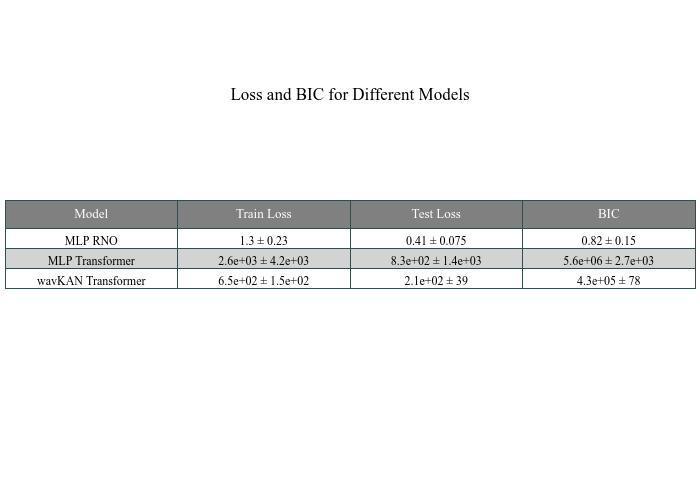
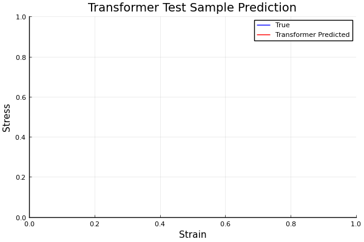
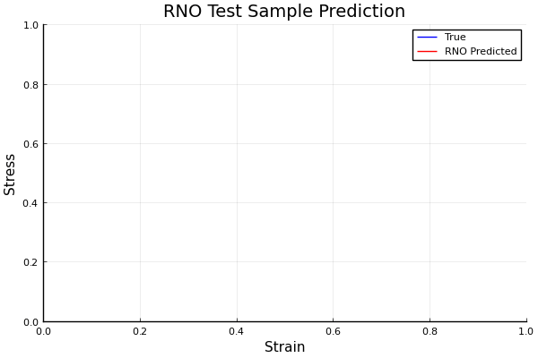

# Julia-Wav-KAN
A Julia implementation of Wavelet Kolmogorov-Arnold Networks. MLP and wavKAN implementations of the Transformer and Recurrent Neural Operator (RNO) are applied to the 1D unit cell problem with a viscoelastic constitutive relation.

## To Run

1. Get dependencies:

```bash
julia requirements.jl
```

2. Tune hyperparameters:

```bash
julia Vanilla_RNO/hyperparameter_tuning.jl
```

```bash
julia wavKAN_RNO/hyperparameter_tuning.jl
```
    
```bash
julia Vanilla_Transformer/hyperparameter_tuning.jl
```
    
```bash
julia wavKAN_Transformer/hyperparameter_tuning.jl
```

3. (Alternatively to 2) Manually configure hyperparameters in the respective `config.ini` files.
    - [Vanilla RNO](https://github.com/PritRaj1/Julia-Wav-KAN/blob/main/Vanilla_RNO/RNO_config.ini)
    - [wavKAN RNO](https://github.com/PritRaj1/Julia-Wav-KAN/blob/main/wavKAN_RNO/KAN_RNO_config.ini)
    - [Vanilla Transformer](https://github.com/PritRaj1/Julia-Wav-KAN/blob/main/Vanilla_Transformer/Transformer_config.ini)
    - [wavKAN Transformer](https://github.com/PritRaj1/Julia-Wav-KAN/blob/main/wavKAN_Transformer/KAN_Transformer_config.ini)

4. Train the models, (model_name variable is set on line 26), and log the results:

```bash
julia train.jl
```

5. Compare the training loops:
  
```bash
julia compare_models.jl
```

6. Visualize the results, (first need to remove PlotlyJS from environment):

```bash
julia
import Pkg; Pkg.rm("PlotlyJS")
```

```bash
julia predict_stress.jl
```

## Results

### Predictive Power and Consistency

<p align="center">
  
</p>

### Visualised Predicted Stress Fields

<p align="center">




</p>

### TODO - Plot FLOPs comparison

Training time was recorded for each of the models, but this is not considered a reliable estimate of the computational cost of the models, given that they were not run on the same hardware, and multiple tasks were running on the same machine. The number of FLOPs for each model will be calculated and compared in the future, once GFlops is updated to work with the latest Julia version.

## Wavelets

<p align="center">
  
    
    
    
    
</p>

## Problem and Data - Unit Cell Problem with Viscoelastic Constitutive Relation

The dataset has been sourced from the University of Cambridge Engineering Department's Part IIB course on [Data-Driven and Learning-Based Methods in Mechanics and Materials.](https://teaching.eng.cam.ac.uk/content/engineering-tripos-part-iib-4c11-data-driven-and-learning-based-methods-mechanics-and)

It consists of the unit cell of a three-phase viscoelastic composite material. The objective is to understand the macroscopic behavior of the material by learning the constitutive relation that maps the strain field $\epsilon(x,t)$ to the stress field $\sigma(x,t)$.

Both a Transformer and a Recurrent Neural Operator (RNO) are implemented in their MLP and wavKAN formats. From a [previous project](https://github.com/PritRaj1/Neural-Operator-Learning), I found this dataset to be especially difficult to learn for the Transformer, but easy enough for the RNO. It is also one-dimensional, making it a prime candidate to compare wavKAN against its MLP equivalents.

### Governing Equations

The behavior of the unit cell is described by the following equations:

#### 1. Kinematic Relation:
The strain field $\epsilon(x,t)$ is related to the displacement field $u(x,t)$ by:

$$ 
\frac{\partial \epsilon(x,t)}{\partial x} = \frac{\partial u(x,t)}{\partial x} 
$$

#### 2. Equilibrium:
The equilibrium condition is given by:

$$ 
\int_0^1 \frac{d\sigma(x)}{dx} = 0 
$$

#### 3. Constitutive Relation:
The stress field $\sigma(x,t)$ is related to the strain field $\epsilon(x,t)$ and the displacement field $u(x,t)$ by:

$$ 
\sigma(x,t) = E(x)\epsilon(x,t) + v(x) \frac{\partial u(x,t)}{\partial t} 
$$

where $E(x)$ is the Young's modulus and $v(x)$ is the viscosity, both of which are piecewise constant functions with three different values corresponding to the three phases of the composite material.

### Initial and Boundary Conditions

#### Initial Conditions:

$$ 
u(x,0) = 0, \quad \dot{u}(x,0) = 0 
$$

#### Boundary Conditions:

$$ 
u(0,t) = 0, \quad u(1,t) = \bar{u}(t) 
$$

where $\bar{u}(t)$ is a prescribed displacement at $x = 1$.

### Composite Material Properties

The composite material is made up of three different phases, each with distinct values of Young's modulus $E(x)$ and viscosity $v(x)$. These properties are piecewise constant functions over the spatial domain $0 \leq x \leq 1$.

### Objective

The objective is to learn the macroscopic constitutive relation that maps the strain field $\epsilon(x,t)$ to the stress field $\sigma(x,t)$:

$$ 
\epsilon \mapsto \sigma
$$

using a macroscopic constitutive model. This model should capture the complex viscoelastic behavior of the composite material.

### Input and Output Framework

##### Input:
The input to the macroscopic constitutive model at each time step $t$ is the macroscopic strain field $\epsilon(x,t)$.

##### Output:
The output of the macroscopic constitutive model at each time step $t$ is the macroscopic stress field $\sigma(x,t)$.

In essence, the macroscopic constitutive model aims to learn the mapping between the applied macroscopic strain field $\epsilon(x,t)$ and the resulting macroscopic stress field $\sigma(x,t)$ at each time step $t$, for all spatial positions $x$ in the three-phase viscoelastic composite material, based on the underlying unit cell problem and its governing equations.

## References

- [Bozorgasl, Z., & Chen, H. (2024). Wav-KAN: Wavelet Kolmogorov-Arnold Networks.](https://arxiv.org/abs/2405.12832)
- [Liu, Z., Wang, Y., Vaidya, S., Ruehle, F., Halverson, J., Soljačić, M., Hou, T. Y., & Tegmark, M. (2024). KAN: Kolmogorov-Arnold Networks.](https://arxiv.org/abs/2404.19756)
- [Mejade Dios, J.-A., Mezura-Montes, E., & Quiroz-Castellanos, M. (2021). Automated parameter tuning as a bilevel optimization problem solved by a surrogate-assisted population-based approach.](https://doi.org/10.1007/s10489-020-02151-y)
- [Liu, B., Cicirello, A. (2024). Cambridge University Engineering Department Part IIB Course on Data-Driven and Learning-Based Methods in Mechanics and Materials.](https://teaching.eng.cam.ac.uk/content/engineering-tripos-part-iib-4c11-data-driven-and-learning-based-methods-mechanics-and)
